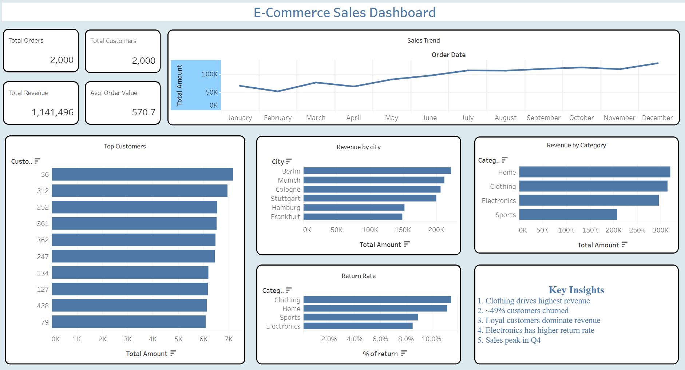

# E-Commerce Sales Analytics

## Overview
This project analyzes a fictional e-commerce dataset to understand customer behavior, sales performance, and product trends.

## Dataset
- Orders
- Customers
- Products
- Returns

## Tools Used
- SQL
- Python (Pandas)
- Tableau

## Key Analysis

### 1. Sales Performance
- Total revenue and order trends analyzed
- Seasonal patterns identified

### 2. Customer Analysis
- RFM (Recency, Frequency, Monetary) analysis performed
- Customer segmentation using K-Means
- ~49% customers identified as churned

### 3. Product Insights
- Clothing category drives highest revenue
- Electronics shows higher return rates

### 4. Returns Analysis
- Return rate varies by category
- Key categories contributing to returns identified

## Dashboard
Includes:
- KPI metrics (Revenue, Orders, Customers, AOV)
- Sales trend
- Revenue by category and city
- Top customers
- Return rate

## Key Insights
- Loyal customers contribute majority of revenue
- Significant churn observed in customer base
- Certain categories have higher return risk
- Sales peak observed in Q4

## Note
This project uses a synthetic dataset to demonstrate real-world analytics workflow including SQL analysis, Python modeling, and dashboarding.

## Conclusion
This project demonstrates ability to analyze transactional data, extract business insights, and build dashboards for decision-making.